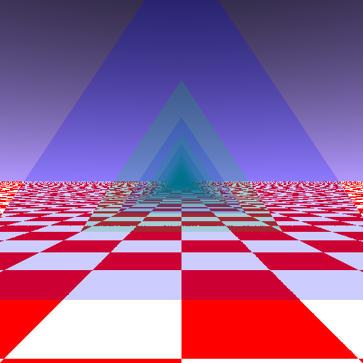
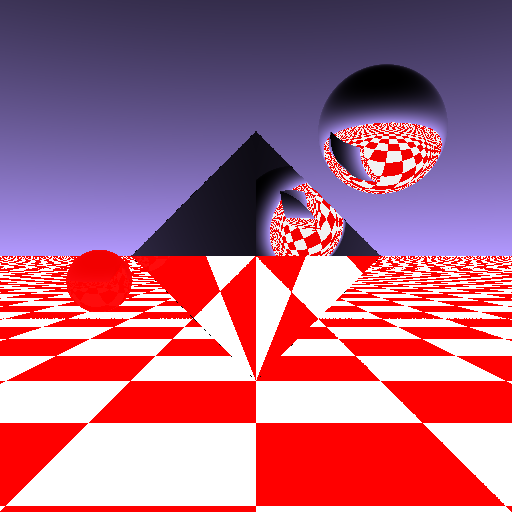
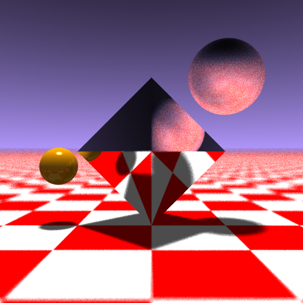
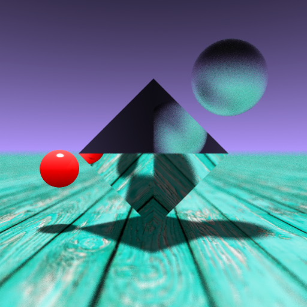

`/!\ repository is work in progress /!\`

Let's Build a Raytracer, From Scratch
=====================================

This repository contains code and assets for an introductory course on raytracing.

Contents
========

* [Level 0: Baby Steps](#level-0-baby-steps)
* [Level 1: Heaven and Earth](#level-1-heaven-and-earth)
* [Level 2: Newfags can't Triforce](#level-2-newfags-cant-triforce)
* [Level 3: Mirror, Mirror](#level-3-mirror-mirror)
* [Level 4: Ray Energy](#level-4-ray-energy)
* [Level 5: The Sphere](#level-5-the-sphere)
* [Level 6: Let there be Light](#level-6-let-there-be-light)
* [Level 7: lol I'm so random](#level-7-lol-im-so-random)
* [Level 8: Textures](#level-8-textures)
* [Level X: The Final Render](#level-x-the-final-render)

Level 0: Baby Steps
-------------------

Creating a 512x512 PPM image.

Level 1: Heaven and Earth
-------------------------

Positioning a virtual camera; casting rays; simple and complex render modes for ground and sky color.

Level 2: Newfags can't Triforce
-------------------------------

Rendering simple monochromatic triangles.

Level 3: Mirror, Mirror
-----------------------

Making rays bounce off triangles: the essence of raytracing.

Level 4: Ray Energy
-------------------

Accumulating color over multiple ray bounces from surfaces with less-than-perfect reflectivity.

Level 5: The Sphere
-------------------

Rendering perfect spheres (not made of polygons).

Level 6: Let there be Light
---------------------------

Tracing a light source; shadows and highlights.

Level 7: lol I'm so random
--------------------------

Using random numbers for anti-aliasing, matte surfaces, soft shadows, and depth-of-field.

Level 8: Textures
-----------------

Rendering textured surfaces

Level X: The Final Render
-------------------------

Final animated render sequence.

Floor texture: ["Turquoise wooden wall"](https://unsplash.com/photos/8RU1Ei3KcPw) by [Maarten Deckers](https://unsplash.com/@maartendeckers) on [Unsplash](https://unsplash.com). Gif minified using [Ezgif's GIF optimizer (lossy)](https://ezgif.com/optimize).

