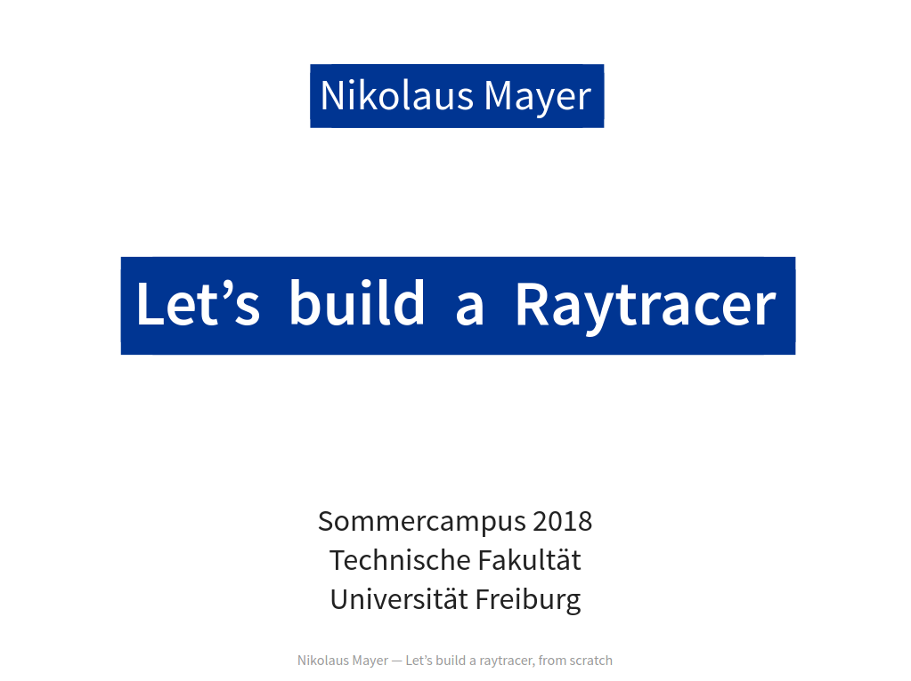

Let's Build a Raytracer, From Scratch
=====================================

This repository contains code, assets, and presentation slides from an introductory course on raytracing.

Note: This repository will **NOT** accept pull requests.

Presentation slides
===================

* Based on revealJS
* Best viewed in Chromium browser at 1024x768
* The version in this repo requires internet connection to load JS dependencies

Errata
------

This course is certainly not perfect. One known "issue" is that the Phong-like illumination model does not have a correct diffuse component, although this is not immediately noticeable.

Code
====

The code is split into "levels" which follow the structure of the course. Each level introduces a new concept and builds on the foundation of the prior levels.

Licenses
========

* The course slides are under [CC-BY-NC](https://creativecommons.org/licenses/by-nc/4.0/legalcode) license.
* Original non-content sources are MIT-licensed.
* The course builds upon third-party elements (frameworks such as reveal.js, libraries such as MathJax, fonts etc.). Each such element may have its own license.

