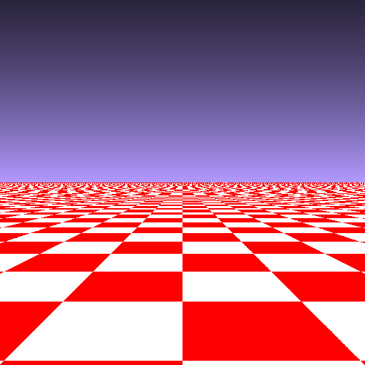
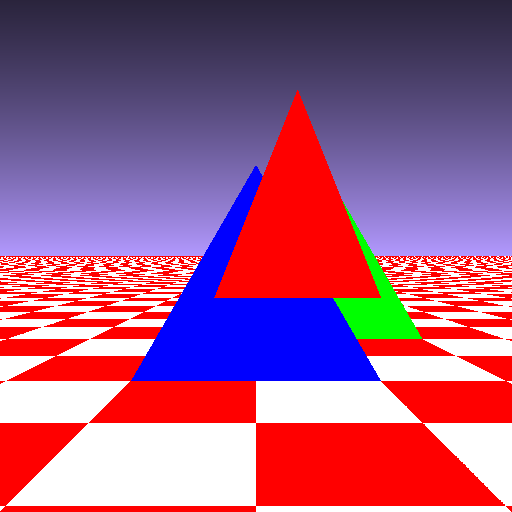
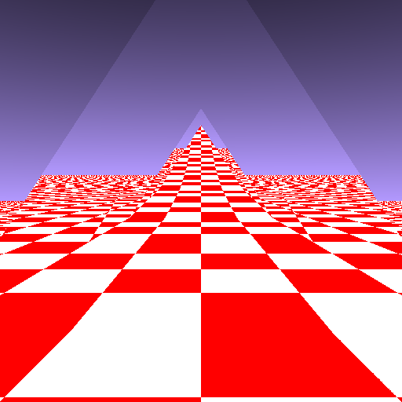

`/!\ repository is work in progress /!\`

Let's Build a Raytracer, From Scratch
=====================================

This repository contains code and assets for an introductory course on raytracing.

Contents
========

* [Level 0: Baby Steps](#level-0-baby-steps)
* [Level 1: Heaven and Earth](#level-1-heaven-and-earth)
* [Level 2: Newfags can't Triforce](#level-2-newfags-cant-triforce)
* [Level 3: Mirror, Mirror](#level-3-mirror-mirror)
* ...
* [Level X: The Final Render](#level-x-the-final-render)

Level 0: Baby Steps
-------------------

Creating a 512x512 PPM image.

Level 1: Heaven and Earth
-------------------------

Positioning a virtual camera; casting rays; simple and complex render modes for ground and sky color.

Level 2: Newfags can't Triforce
-------------------------------

Rendering simple monochromatic triangles.

Level 3: Mirror, Mirror
-------------------------------

Making rays bounce off triangles: the essence of raytracing.

Level X: The Final Render
-------------------------

Final animated render sequence.

Floor texture: ["Turquoise wooden wall"](https://unsplash.com/photos/8RU1Ei3KcPw) by [Maarten Deckers](https://unsplash.com/@maartendeckers) on [Unsplash](https://unsplash.com). Gif minified using [Ezgif's GIF optimizer (lossy)](https://ezgif.com/optimize).

